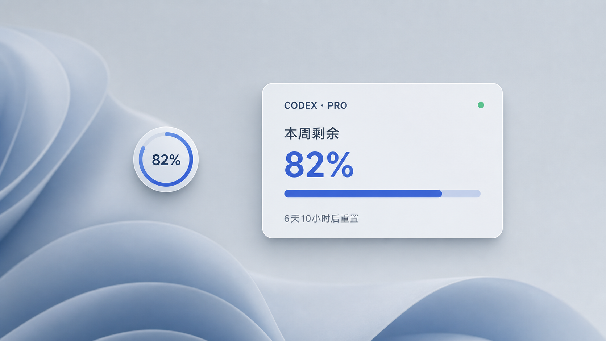
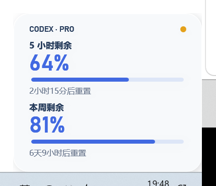

# Codex Quota Float

> 非官方 Windows Codex 额度桌面悬浮球。An unofficial Windows desktop quota widget for Codex.



Codex Quota Float 是一个轻量的 Windows 桌面小组件：紧凑状态显示当前可用额度百分比，单击后展开查看可用的 5 小时与本周额度窗口。它依赖用户另行安装的 Win-CodexBar，不是 OpenAI、Codex 或 Win-CodexBar 的官方项目，也未获得这些项目的背书。

## 功能

- 60 × 60 像素置顶悬浮球，显示当前最合适的额度窗口与环形进度。
- 单击展开 250 像素宽的详情卡；仅显示 CLI 实际返回的 5 小时或本周额度行。
- 显示剩余百分比、重置时间、套餐标签和数据新鲜度状态。
- 每 60 秒尝试刷新；刷新失败时保留最近一次成功缓存，并标记为数据暂未更新。
- 支持拖动定位、记住位置、立即刷新、打开 Win-CodexBar 完整统计、开机启动和单实例运行。
- 按剩余额度切换蓝、黄、红三档提示色。

## 界面

首页主图是视觉展示；下面两张是当前程序的实际紧凑与展开状态截图。

### 紧凑状态


### 展开状态



## 系统要求

- Windows 桌面环境，以及系统自带的 Windows PowerShell 5.1 和 WPF 组件。
- 已安装并能正常读取 Codex 用量的 [Win-CodexBar](https://github.com/Finesssee/Win-CodexBar)。
- 有效的 Codex 登录状态；额度刷新所需的网络和登录行为由 Win-CodexBar 负责。
- 推荐使用 Windows Package Manager（`winget`）安装依赖。若已经以其他方式安装 Win-CodexBar，可直接配置下文的 CLI 路径。

## 安装 Win-CodexBar

在 PowerShell 中安装外部依赖：

```powershell
winget install Finesssee.Win-CodexBar
```

先在 Win-CodexBar 中完成登录，并确认它能够显示 Codex 用量。Codex Quota Float 只调用已安装副本中的 `codexbar-cli.exe`；本仓库不捆绑或再分发 Win-CodexBar。

程序按以下顺序寻找 CLI：

1. 环境变量 `CODEXBAR_CLI_PATH` 指定的文件；
2. 默认位置 `%LOCALAPPDATA%\Programs\CodexBar\codexbar-cli.exe`；
3. `PATH` 中的 `codexbar-cli.exe`。

如果 Win-CodexBar 安装在非默认目录，请把 `CODEXBAR_CLI_PATH` 设置为 `codexbar-cli.exe` 的完整路径。例如，设置当前 PowerShell 会话后再安装：

```powershell
$env:CODEXBAR_CLI_PATH = 'D:\Apps\CodexBar\codexbar-cli.exe'
powershell.exe -NoProfile -ExecutionPolicy Bypass -File .\install.ps1
```

若要让开机启动后的悬浮球也使用该路径，请同时把它保存为 Windows 用户环境变量，并在重新登录后启动悬浮球。

## 安装悬浮球

下载或克隆本仓库，进入包含 `install.ps1` 的目录，然后运行：

```powershell
powershell.exe -NoProfile -ExecutionPolicy Bypass -File .\install.ps1
```

安装脚本会：

- 把运行文件复制到 `%APPDATA%\CodexQuotaFloat`；
- 在当前用户的 `HKCU\Software\Microsoft\Windows\CurrentVersion\Run` 中注册 `CodexQuotaFloat` 开机启动项；
- 启动隐藏 PowerShell 窗口中的悬浮球。

安装只影响当前 Windows 用户，不需要写入系统级目录。

## 使用

- 左键单击：展开或收起详情卡。
- 按住左键拖动：移动悬浮球；位置保存在本机设置中。
- 右键菜单“立即刷新”：请求一次新的 CLI 数据；正在进行的刷新不会重复启动。
- 右键菜单“开机启动”：重新注册当前用户的启动项。
- 右键菜单“打开完整统计”：打开 Win-CodexBar 桌面程序；非默认安装可用 `CODEXBAR_APP_PATH` 指定 `codexbar.exe` 的完整路径。
- 右键菜单“退出”：关闭悬浮球。开机启动项仍会保留。

## 更新

下载新版文件，进入新版目录，再次运行 `install.ps1`：

```powershell
powershell.exe -NoProfile -ExecutionPolicy Bypass -File .\install.ps1
```

脚本会停止已安装的悬浮球、覆盖 `%APPDATA%\CodexQuotaFloat` 中的运行文件、刷新开机启动项并重新启动。已有的 `settings.json` 与 `last_usage.json` 不在覆盖列表中，因此位置设置和最近缓存会保留。

## 卸载

从下载目录或 `%APPDATA%\CodexQuotaFloat` 运行：

```powershell
powershell.exe -NoProfile -ExecutionPolicy Bypass -File .\uninstall.ps1
```

卸载脚本会停止已安装实例、删除当前用户的 `CodexQuotaFloat` 开机启动项，并移除 `%APPDATA%\CodexQuotaFloat`（包括设置与额度缓存）。若脚本正从安装目录中运行，删除会由临时后台清理脚本完成，命令可能先显示 `uninstall cleanup scheduled`。

卸载 Codex Quota Float 不会卸载 Win-CodexBar；如不再需要，请按 Win-CodexBar 自己的说明单独处理。

## 数据来源与隐私

- 数据不是由本项目调用所谓“官方 Codex API”获得。悬浮球每 60 秒在本机调用外部命令 `codexbar-cli.exe usage -p codex --format json`，再把返回内容转换为显示数据。
- 数据含义、登录方式、上游请求和更新时间由 Win-CodexBar 决定。刷新有周期，失败时还会回退缓存，因此页面数据不保证绝对实时，也不应作为计费凭证。
- 本项目代码不直接读取、复制、显示或保存 Codex 登录凭证，也没有自建的遥测或数据上传逻辑。
- 本地数据位于 `%APPDATA%\CodexQuotaFloat`：`last_usage.json` 保存处理后的套餐标签、剩余百分比、重置描述和上游更新时间；`settings.json` 保存窗口位置。它们是当前 Windows 用户可访问的普通 JSON 文件。
- Win-CodexBar 是独立的第三方软件，拥有自己的许可证、数据处理方式和安全边界。安装前请自行审阅其上游项目。

## 故障排查

### 提示“未找到 CodexBar 工具”

确认 CLI 存在：

```powershell
Test-Path "$env:LOCALAPPDATA\Programs\CodexBar\codexbar-cli.exe"
Get-Command codexbar-cli.exe -ErrorAction SilentlyContinue
```

如果安装在其他位置，设置 `CODEXBAR_CLI_PATH` 后退出并重新启动悬浮球。环境变量必须指向文件本身，而不是目录。

### 一直显示旧数据或“数据暂未更新”

在 PowerShell 中直接验证 CLI 输出：

```powershell
& "$env:LOCALAPPDATA\Programs\CodexBar\codexbar-cli.exe" usage -p codex --format json
```

若命令失败、没有 `codex` 提供方，或提示登录失效，请先在 Win-CodexBar 中重新登录。悬浮球会继续展示上次成功缓存，直到刷新恢复。

### 悬浮球没有出现

先从右键菜单退出可能存在的旧实例，再在仓库目录前台运行主脚本查看错误：

```powershell
powershell.exe -NoProfile -ExecutionPolicy Bypass -File .\CodexQuotaFloat.ps1
```

程序采用单实例互斥；已有实例运行时，新进程会直接退出。也请确认当前处于可交互的 Windows 桌面会话，并且 WPF 可用。

### “打开完整统计”没有反应

该菜单需要找到 `codexbar.exe`。默认位置之外的安装可通过用户环境变量 `CODEXBAR_APP_PATH` 指定完整文件路径；这不会影响额度 CLI 的查找。

### 开机后没有自动启动

重新运行 `install.ps1`，然后检查当前用户启动项：

```powershell
Get-ItemProperty 'HKCU:\Software\Microsoft\Windows\CurrentVersion\Run' -Name CodexQuotaFloat
```

## 开发与测试

项目使用 Windows PowerShell 脚本，无需构建步骤。常用的非交互回归测试可逐个运行：

```powershell
powershell.exe -NoProfile -ExecutionPolicy Bypass -File .\tests\QuotaData.Tests.ps1
powershell.exe -NoProfile -ExecutionPolicy Bypass -File .\tests\WidgetStructure.Tests.ps1
powershell.exe -NoProfile -ExecutionPolicy Bypass -File .\tests\Lifecycle.Tests.ps1
powershell.exe -NoProfile -ExecutionPolicy Bypass -File .\tests\Install.Tests.ps1
powershell.exe -NoProfile -ExecutionPolicy Bypass -File .\tests\PublicRelease.Tests.ps1
```

交互点击测试 `tests\WidgetClick.Tests.ps1` 需要可见的 Windows 桌面会话，会启动并操作真实 WPF 窗口。

## 第三方项目与免责声明

- Win-CodexBar 是外部 MIT 许可依赖，项目地址为 <https://github.com/Finesssee/Win-CodexBar>；详见 [THIRD_PARTY_NOTICES.md](THIRD_PARTY_NOTICES.md)。
- 本仓库仅调用用户已安装的 Win-CodexBar CLI，不包含其源码或可执行文件，也不代表其维护者。
- OpenAI、Codex、Win-CodexBar 及其他名称和商标归各自权利人所有。
- 本软件按现状提供，不保证数据完整性、可用性、准确性或时效性。涉及账户、订阅或费用的决定，请以相关服务自身显示的信息为准。

## License

本项目以 [MIT License](LICENSE) 发布。第三方软件继续适用各自的许可证。
