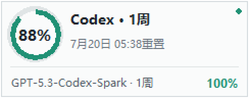

# 我给 Codex 做了一个桌面额度悬浮窗：少点两步，随时看到剩余用量

**备选标题**：总担心 Codex 额度不够？我做了一个无感刷新的桌面小工具

**摘要**：Codex 的额度百分比藏在菜单里，每次查看都要点好几步。我做了一个 Windows 桌面悬浮窗，直接读取官方额度、后台静默刷新，并把隐私边界收紧到只碰额度数据。

**封面文案**：Codex 额度，不用再点开看

---

我每天使用 Codex 时，有一个很小但很高频的焦虑：额度还剩多少？

答案其实能在 Codex 里找到，但每次都要打开账号菜单，再展开剩余用量。一天查几次不算大事，可当操作重复出现，它就会一直打断当前工作。

所以我做了一个轻量桌面工具：**Codex Quota Float**。



## 第一版其实没有意义

最初版本已经能悬浮、置顶、打开详情，但最关键的位置只能显示 `N/A`。原因很简单：我当时只读取了本地活动信息，没有拿到官方剩余百分比。

这也让我重新确认了产品的核心：它不是一个“看起来像额度工具”的窗口，而是必须减少查看真实额度的操作成本。没有实时百分比，悬浮窗再漂亮也没有存在意义。

## 后来怎么拿到真实额度

继续检查 Codex 自身的数据流后，我改为通过本地 Codex app-server 调用官方的 `account/rateLimits/read` 方法。

现在悬浮窗可以显示：

- Codex 官方返回的剩余百分比；
- 当前额度周期；
- 下一次重置日期和时间；
- 官方额外返回的独立模型额度桶；
- 实时读取失败时，上一次成功读取的官方缓存。

这里有一个容易误解的地方：**模型选择列表不等于额度列表**。

Codex 里可以选择很多模型，但它们可能共用同一个额度池。插件不会给每个模型编一个百分比，只展示官方接口实际返回的额度桶。比如 `codex` 是通用共享额度；只有官方另外返回某个模型的额度时，详情里才会单独出现。

## 我最后保留了哪些交互

我希望它平时像桌面状态灯，而不是另一个需要管理的软件：

- 默认是 64 px 的额度圆环；
- 单击展开简要信息；
- 双击打开完整详情；
- 拖动后自动记住位置；
- 后台约每 60 秒静默刷新；
- 刷新失败不会弹窗打断工作；
- 右键可以手动刷新、打开网页面板或退出。

它目前的设计仍然偏工具化。下一步我更想尝试“数字优先的圆角方块”样式，让低分辨率下的文字和边缘更干净，但不会为了视觉重做而牺牲信息准确性。

## 隐私边界也重新收紧了

为了让别人可以放心安装，公开版删除了最初用于辅助判断的本地任务活动读取。现在它：

- 不读取 `auth.json`；
- 不读取任务标题、提示词、对话内容或任务数据库；
- 不根据本地 Token 活动估算官方额度；
- 只把最近一次官方额度响应缓存在本机；
- 网页面板固定监听 `127.0.0.1`，不会开放到局域网。

登录态由 Codex 自己处理，插件不接触认证文件。

## 如何安装

项目地址：

`https://github.com/zsy1122334455-netizen/codex-quota-float`

在终端中执行：

```powershell
codex plugin marketplace add zsy1122334455-netizen/codex-quota-float
codex plugin add codex-quota-float@codex-quota-float
```

安装后，在 Codex 中直接说“打开 Codex 额度悬浮窗”即可。

目前需要 Windows 10/11、已登录的 Codex，以及带 Tkinter 的 Python 3.11 或更高版本。

## 它还不算完成

这是一个能解决真实问题的预览版，但还有几个明确限制：

1. 当前只支持 Windows。
2. 额度读取依赖 Codex 的实验性接口，未来可能需要跟随上游更新。
3. 不同账户可能返回不同的额度结构，需要更多真实环境验证。
4. 视觉细节还有提升空间，尤其是系统缩放和低分辨率下的抗锯齿表现。

如果你也经常查看 Codex 额度，欢迎试用后在 GitHub 提交 Issue。对我最有价值的反馈不是“好不好看”，而是：它有没有真的减少一次打断，以及在你的账户上是否准确显示了官方额度。

项目开源采用 MIT 许可证，与 OpenAI 无隶属关系。
